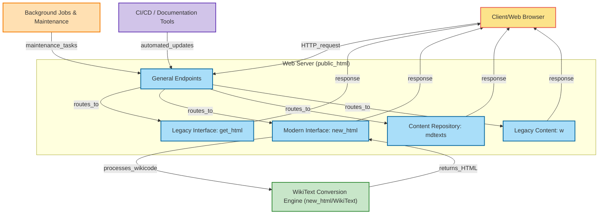

```mermaid
graph TD
    A["Client/Web Browser"]:::client

    subgraph "Web Server (public_html)"
        direction TB
        I["General Endpoints"]:::server
        B["Legacy Interface: get_html"]:::server
        C["Modern Interface: new_html"]:::server
        D["Content Repository: mdtexts"]:::server
        E["Legacy Content: w"]:::server
    end

    F["WikiText Conversion Engine (new_html/WikiText)"]:::conversion
    G["Background Jobs & Maintenance"]:::maintenance
    H["CI/CD / Documentation Tools"]:::devops

    A -->|"HTTP_request"| I
    I -->|"routes_to"| B
    I -->|"routes_to"| C
    I -->|"routes_to"| D
    I -->|"routes_to"| E

    B -->|"response"| A
    C -->|"response"| A
    D -->|"response"| A
    E -->|"response"| A

    C -->|"processes_wikicode"| F
    F -->|"returns_HTML"| C

    G -->|"maintenance_tasks"| I
    H -->|"automated_updates"| I

    click I "https://github.com/mdwikicx/medwiki.toolforge.org/tree/main/public_html"
    click B "https://github.com/mdwikicx/medwiki.toolforge.org/tree/main/public_html/get_html"
    click C "https://github.com/mdwikicx/medwiki.toolforge.org/tree/main/public_html/new_html"
    click D "https://github.com/mdwikicx/medwiki.toolforge.org/tree/main/public_html/mdtexts"
    click E "https://github.com/mdwikicx/medwiki.toolforge.org/tree/main/public_html/w"
    click F "https://github.com/mdwikicx/medwiki.toolforge.org/tree/main/public_html/new_html/WikiText"
    click G "https://github.com/mdwikicx/medwiki.toolforge.org/tree/main/jobs"
    click H "https://github.com/mdwikicx/medwiki.toolforge.org/tree/main/.github/workflows"

    classDef client fill:#fce38a,stroke:#e85a4f,stroke-width:2px;
    classDef server fill:#a9def9,stroke:#07689f,stroke-width:2px;
    classDef conversion fill:#c8e6c9,stroke:#388e3c,stroke-width:2px;
    classDef maintenance fill:#ffe0b2,stroke:#f57c00,stroke-width:2px;
    classDef devops fill:#d1c4e9,stroke:#673ab7,stroke-width:2px;
```
